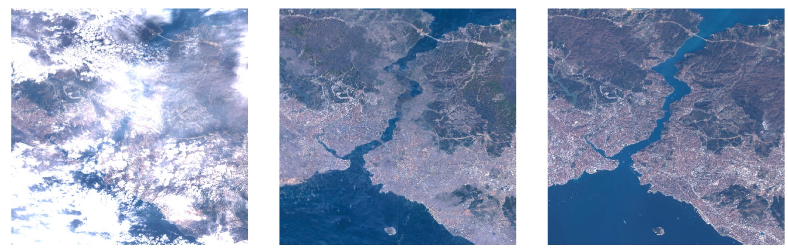

# Cloud removal in Sentinel-2 imagery using a deep residual neural network and SAR-optical data fusion
[](https://www.journals.elsevier.com/isprs-journal-of-photogrammetry-and-remote-sensing/news/the-u-v-helava-award-best-paper-volumes-159-170-2020)

[](https://paperswithcode.com/sota/cloud-removal-on-sen12ms-cr?p=cloud-removal-in-sentinel-2-imagery-using-a)


>
> _Example results from the final setup of DSen2-CR using the CARL loss. Left is the input cloudy image, middle is the predicted image, right is the cloud-free target image._
----
This repository contains the code and models for the paper
> Meraner, A., Ebel, P., Zhu, X. X., & Schmitt, M. (2020). Cloud removal in Sentinel-2 imagery using a deep residual neural network and SAR-optical data fusion. ISPRS Journal of Photogrammetry and Remote Sensing, 166, 333-346.

The open-access paper is available at [the Elsevier ISPRS page](https://doi.org/10.1016/j.isprsjprs.2020.05.013).

The paper [won the ISPRS 2020 Best Paper Award](https://www.journals.elsevier.com/isprs-journal-of-photogrammetry-and-remote-sensing/news/the-u-v-helava-award-best-paper-volumes-159-170-2020), and is therefore nominated for the 2020-2024 U. V. Helava Award.

If you use this code, models or dataset for your research, please cite us accordingly:
```bibtex
@article{Meraner2020,
title = "Cloud removal in Sentinel-2 imagery using a deep residual neural network and SAR-optical data fusion",
journal = "ISPRS Journal of Photogrammetry and Remote Sensing",
volume = "166",
pages = "333 - 346",
year = "2020",
issn = "0924-2716",
doi = "https://doi.org/10.1016/j.isprsjprs.2020.05.013",
url = "http://www.sciencedirect.com/science/article/pii/S0924271620301398",
author = "Andrea Meraner and Patrick Ebel and Xiao Xiang Zhu and Michael Schmitt",
keywords = "Cloud removal, Optical imagery, SAR-optical, Data fusion, Deep learning, Residual network",
}
```

# Code

---

**NOTE**

The code in this repository has been created in my early Python years and might not be the most elegant in some parts. I apologize for eventual issues or possible bugs. 

Should you notice something in the code, please feel free to create a Github issue (or, even better, a pull request :)), or let me know at the address  [andrea.meraner [at] eumetsat.int](mailto:andrea.meraner@eumetsat.int) ! 

---

## Installation
The network is written in Keras with Tensorflow as backend. It is strongly advised to use GPU support to run the models.

A conda environment with the required dependencies can be created with
```bash
conda create -n dsen2cr_env
conda activate dsen2cr_env
conda install -c conda-forge python=3.7 tensorflow-gpu=1.15.0 keras=2.2.4 numpy scipy rasterio pydot graphviz h5py
```

Alternatively, a Dockerfile is provided in `Docker/Dockerfile` which can be used to create a Docker image including CUDA.

Note: 
This code has been mainly written at the end of 2018/start of 2019 with the Python packages versions available at that time. A usage with updated packages might require some modification of the code.
If you try this code with updated libraries, please let me know your findings ([andrea.meraner [at] eumetsat.int](mailto:andrea.meraner@eumetsat.int)).

To clone the repo:
```bash
git clone git@github.com:ameraner/dsen2-cr.git
cd dsen2-cr
```

## Usage
### Basic Commands
A new model can be trained from scratch by simply launching
```bash
cd Code/
python dsen2cr_main.py
```
The setup and hyperparameters can be tuned directly in the first lines of the main code.

To resume the training from a previoulsy saved checkpoint, type
```bash
python dsen2cr_main.py --resume path/to/checkpoint.h5
```

To predict images and evaluate the metrics of a trained network, do
```bash
python dsen2cr_main.py --predict path/to/checkpoint.h5
```

### Dataset Paths
The main code will look for the paths to training/validation/test data in the csv file `Data/datasetfilelist.csv`.
An example is provided in the repository. The first column of each entry is an integer, where `1` defines a training sample, 
`2` a validation sample, and `3` a test sample. The second, third, and fourth column indicate the subfolder names where the
Sentinel-1, Sentinel-2 Cloudfree, and Sentinel-2 Cloudy images are located respectively. The fifth column finally states the 
filename of the image, that must be the same in the three folders.
The three subfolders must be located in the path defined by the variable `input_data_folder` in the main script.

# Trained Model Checkpoints
The full DSen2-CR model trained by optimizing the CARL loss can be downloaded from Google Drive [here](https://drive.google.com/file/d/1L3YUVOnlg67H5VwlgYO9uC9iuNlq7VMg/view?usp=sharing).

The full model trained on a plain L1 loss can be downloaded [here](https://drive.google.com/file/d/1zv4_91Yr2IYyYDoqhZw8KpnfvfLhkuBB/view?usp=sharing). The network trained on CARL but without SAR input 
can be found [here](https://drive.google.com/file/d/1VHZa5-lX68mA2FbHeCiQsUq13oECw9DA/view?usp=sharing). The network trained without SAR, and on plain L1 loss, can be found [here](https://drive.google.com/file/d/11Th6UwKMXla7LGxsFJXwj-Jx9bSKlWUH/view?usp=sharing).


# Dataset
The dataset used in this work is called SEN12MS-CR. It is now publicly available for download [here](https://mediatum.ub.tum.de/1554803).
If you use this dataset for your research, please cite our related IEEE TGRS paper 
> Ebel, P., Meraner, A., Schmitt, M., & Zhu, X. X. (2020). Multisensor Data Fusion for Cloud Removal in Global and All-Season Sentinel-2 Imagery. IEEE Transactions on Geoscience and Remote Sensing.

describing the dataset release. The paper can be accessed
for free at [the IEEE Explore page](https://ieeexplore.ieee.org/stamp/stamp.jsp?tp=&arnumber=9211498).
```bibtex
@article{Ebel2020,
  author={P. {Ebel} and A. {Meraner} and M. {Schmitt} and X. X. {Zhu}},
  journal={IEEE Transactions on Geoscience and Remote Sensing}, 
  title={Multisensor Data Fusion for Cloud Removal in Global and All-Season Sentinel-2 Imagery}, 
  year={2020},
  volume={},
  number={},
  pages={1-13},
  doi={10.1109/TGRS.2020.3024744}}
```

# Credits
Although now heavily modified and expanded, this code was originally based on the code by [Charis Lanaras](https://github.com/lanha)
available in [the DSen2 repo](https://github.com/lanha/DSen2). Also the network used by this work is, as the name suggests, 
heavily based on the original DSen2 network (see [related paper](https://www.sciencedirect.com/science/article/abs/pii/S0924271618302636)). 
I am grateful to the authors for making the original source code available.

